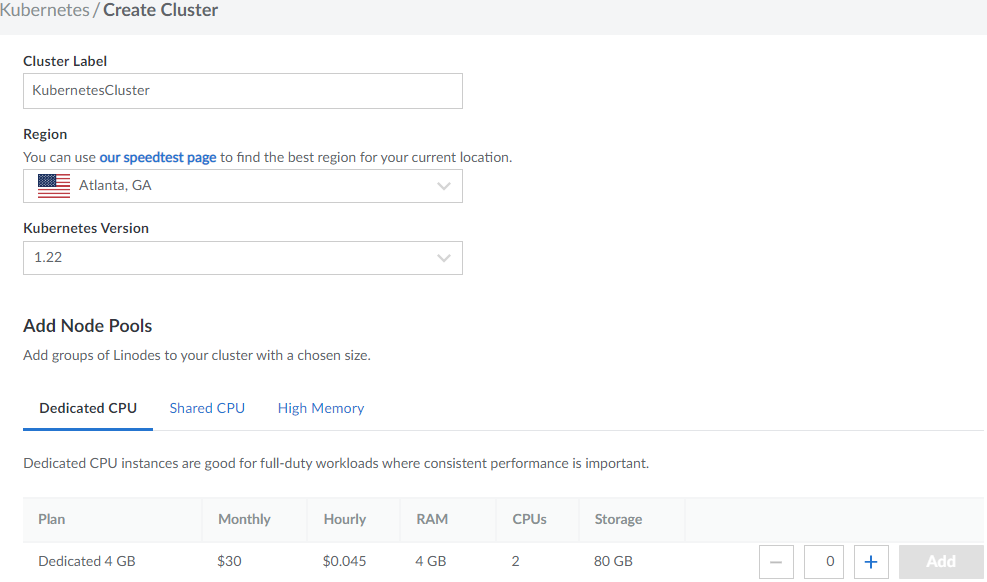
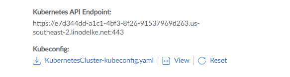
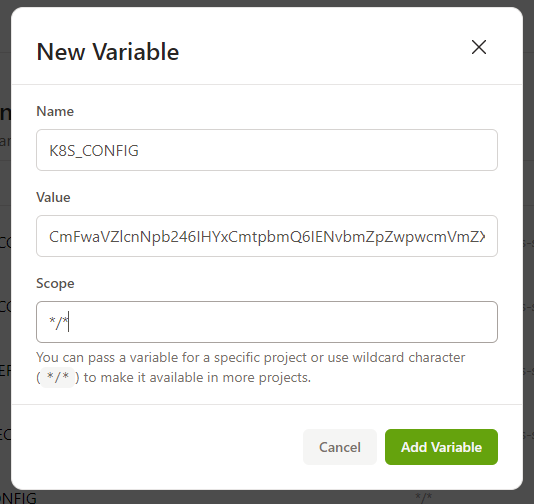

# Build You Kubernetes Playground in less than 5 minute for FREE!!
As a Kubernetes Administrator, Developer or Security Specialist. You may need to launch Clusters, Pods, Services, PVs, PVCs and other objects on the fly for testing purposes. This Repo will help you to launch Kubernetes Clusters, Execute kubectl Commands and Apply Kubernetes Manifest files in less than 5 minute from you browser on any platform (PC, Laptop, Tablet, Ipad or even from you SmartPhone) for FREE!!

## Tools:
- [Linode]
- [Gitpod]

## Steps
### Sign up for a new account in [Linode]
- Get 100$ free credit

### Create a new [Linode Kubernetes Engine (LKE)]
- Go to Kubernetes -> Create Cluster -> Add 3 Dedicated 4 GB Nodes
- Enter the Cluster Label, Select the Region and Kubernetes Latest Stable Version
- Click Create Cluster



### Copy your KubeConfig Manifest file
- Go to Kubernetes -> Cluster Name -> View -> Copy



### Encode KubeConfig Manifest file
- Using online tool [base64encode] -> Paste you KubeConfig base64 -> Click Encode
- Copy the KubeConfig base64 Manifest

### Sign up for new account in [Gitpod]
- Get a free 50 hours/month

### Add KubeConfig Variable
- Go to Gitpod Dashboard -> Settings -> Variables -> New Variable
- Enter the Variable Name K8S_CONFIG
- Enter the Value with the output of the KubeConfig base64 Manifest
- Enter the Scope \*/\*
- Click Add Variable





### Install Gitpod Extenstion
- [Google Chrome]

### Fork this Repo
- It is better to have your own repo which will be cloned to the Gitpod workspace so scroll up and Click on the fork button

### Create Gitpod Workspace
- It is time to launch your Gitpod workspace so scroll up and Click on Gitpod button
- Wait for the workspace docker [container] to be launched and [vscode] to be loaded

# Execute Kubectl commands, Apply Kubernetes Manifest files and Have Fun!!
```
gitpod /workspace/KubernetesGitpodWorkspace (main) $ kubectl get nodes
NAME                          STATUS   ROLES    AGE     VERSION
lke54567-85543-6228b8a278cf   Ready    <none>   7m48s   v1.22.6
lke54567-85543-6228b8a28f6f   Ready    <none>   7m44s   v1.22.6
lke54567-85543-6228b8a2a531   Ready    <none>   7m44s   v1.22.6
```

### Caution!! Cleanup your resources
- Don't forget to delete Gitpod Workspace!
- Don't forget to delete Linode LKE Cluster! (Delete NOT Poweroff)

[Linode]: https://www.linode.com/
[Gitpod]: https://www.gitpod.io/
[base64encode]: https://www.base64encode.org/
[Linode Kubernetes Engine (LKE)]: https://www.linode.com/products/kubernetes/
[Google Chrome]: https://chrome.google.com/webstore/detail/gitpod-always-ready-to-co/dodmmooeoklaejobgleioelladacbeki
[container]: https://www.docker.com/resources/what-container
[vscode]: https://code.visualstudio.com/
